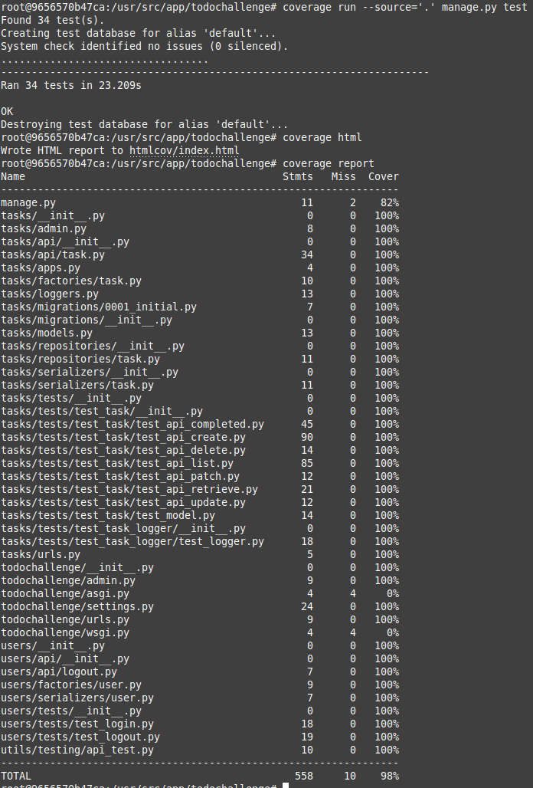
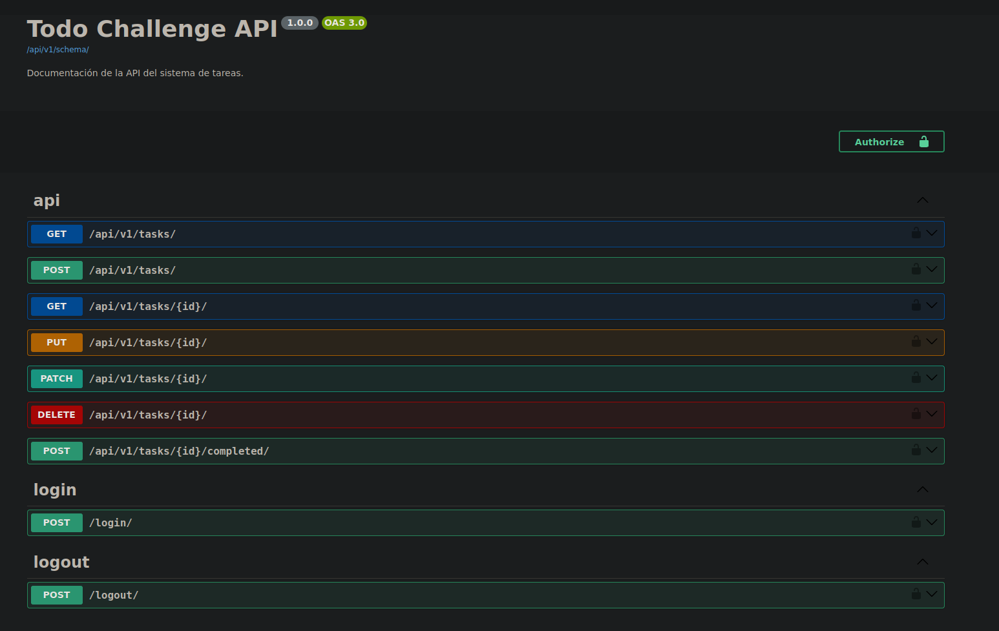

### ToDo Challenge - Invera

El presente documento posee las características principales de la resolución planteada al [challenge de Invera](Invera.md).


##### Requerimientos

- Docker (y docker-compose).

##### Versiones principales utilizadas
- Python: 3.13.
- Django: 5.2 (LTS).
- Postgres: 17.5.

#### Infraestructura

La infraestructura es muy simple, consta del servidor backend y de la BDD Postgres. Para *robustecerlo* se debería añadir algun servidor web (nginx por ejemplo) y cambiar las configuraciones acorde a un entorno productivo.

##### Guía
1. Acceder a la carpeta docker y ejecutar:
   ```bash
   cd docker
   ```
2. Ejecutar:
   ```bash
   docker-compose up --build
   ```
   Se levantarán dos contenedores, uno con la BDD Postgres y el restante con el propio backend desarrollado en python (puerto 8001).

   **Importante**:  Si es la primera vez que se levanta puede suceder que la BDD tarde más en desplegarse que el backend y arroje error de conexión. En ese caso, volver a ejecutar el comando *docker-compose down* y luego *docker-compose up --build*. No quise cambiar la politica de reinicio del servidor backend.

3. Para ejecutar los tests:
   ```bash
   docker exec -it todochallenge_backend bash
   # ya dentro del contenedor
   cd todochallenge
   python manage test --parallel
   ```
   


4. Para hacer pruebas en la api se puede crear un usuario desde el Admin de Django o dentro del contenedor:
   ```bash
   python manage.py loaddata ./users/fixutures/users_fixture.json
   ```
   Se creara un usuario de prueba con el cual es posible logearse en la api.
   - username=test_user
   - password=todochallenge

5. Documentacion de la API:
   - [localhost:8001/api/v1/docs/](localhost:8001/api/v1/docs/)
   - [localhost:8001/api/v1/redocs/](localhost:8001/api/v1/redocs/)
   

#### Consideraciones

- En la carpeta log en la raiz del proyecto se encuetra un archivo *task.log* que almacena logs de la crecion y completado de tasks. El punto de manejo de logs lo interpreté de esta manera (loggear alguna acción). Tal vez se pretendía la instalacion y uso de una herramienta como Sentry, o la muestra mediante Grafana pero por el uso opcional de docker (en el enunciado) me decliné por algo más simple.
- La acción de completar una tarea (tasks/{PK}/completed) podría desarrollarse utilzando PATCH o PUT. La decisión del POST es arbitraria.
- No permitir en la creación y actualización la elección del usuario tambien fue una desición arbitraria. Podría hasta ser controversial considerando que si es posible actualizar, borrar o completar una tarea ajena. 

